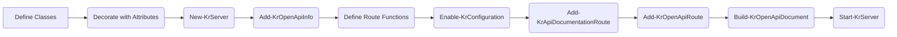

# OpenAPI Generation

End-to-end guide for generating and documenting RESTful APIs with [OpenAPI 3.0+ specifications](https://spec.openapis.org/oas/v3.1.0) using Kestrun's PowerShell
cmdlets and class-based attributes.

Focus areas:

- **Class-based Components**: Define schemas, request bodies, and responses using PowerShell classes.
- **Attributes**: Decorate classes and properties with `[OpenApiSchemaComponent]`, `[OpenApiPropertyAttribute]`, etc.
- **Document Metadata**: Configure title, version, contact, license, and servers.
- **Operation Decorators**: Annotate route functions with `[OpenApiPath]`, `[OpenApiResponse]`, and `[OpenApiRequestBody]`.
- **Inheritance**: Reuse schemas via class inheritance.

> Kestrun uses a **code-first** approach where PowerShell classes define your data models and attributes define your API specification.

---

## 1. Concepts

| Concept              | Description                                                                    |
|----------------------|--------------------------------------------------------------------------------|
| **Schema Component** | A PowerShell class decorated with `[OpenApiSchemaComponent]`. Defines data structure. |
| **Request Body**     | A class decorated with `[OpenApiRequestBodyComponent]`. Defines payload structure. |
| **Response**         | A class decorated with `[OpenApiResponseComponent]`. Defines response structure. |
| **Parameter**        | A class decorated with `[OpenApiParameterComponent]`. Defines reusable parameters. |
| **Property Attribute**| `[OpenApiPropertyAttribute]` on class properties defines validation, examples, and descriptions. |
| **Route Attribute**  | `[OpenApiPath]` on functions defines the HTTP method and route pattern. |

---

## 2. Typical Workflow



---

## 3. Minimal Example

```powershell
# 1. Define a Schema
[OpenApiSchemaComponent(Required = ('name'))]
class Pet {
    [OpenApiPropertyAttribute(Description = 'Pet ID', Example = 1)]
    [long]$id

    [OpenApiPropertyAttribute(Description = 'Pet Name', Example = 'Fido')]
    [string]$name
}

# 2. Setup Server & Metadata
$srv = New-KrServer -Name 'Pet API'
Add-KrEndpoint -Port 5000
Add-KrOpenApiInfo -Title 'Pet API' -Version '1.0.0'

# 3. Define Route
function getPet {
    [OpenApiPath(HttpVerb = 'get', Pattern = '/pets/{id}')]
    [OpenApiResponse(StatusCode = '200', Description = 'Found pet', Schema = [Pet])]
    param([int]$id)

    Write-KrJsonResponse @{ id = $id; name = 'Fido' }
}

# 4. Enable & Build
Enable-KrConfiguration
Add-KrApiDocumentationRoute -DocumentType Swagger
Add-KrOpenApiRoute

Build-KrOpenApiDocument
Start-KrServer -Server $srv
```

---

## 4. Component Schemas

Use `[OpenApiSchemaComponent]` to define reusable data models.

### 4.1 Basic Schema

```powershell
[OpenApiSchemaComponent(Required = ('username', 'email'))]
class User {
    [OpenApiPropertyAttribute(Description = 'Unique ID', Format = 'int64', Example = 1)]
    [long]$id

    [OpenApiPropertyAttribute(Description = 'Username', Example = 'jdoe')]
    [string]$username

    [OpenApiPropertyAttribute(Description = 'Email address', Format = 'email')]
    [string]$email
}
```

### 4.2 Enums and Validation

Use PowerShell validation attributes alongside OpenAPI attributes.

```powershell
[OpenApiSchemaComponent()]
class Product {
    [OpenApiPropertyAttribute(Description = 'Product Status', Example = 'available')]
    [ValidateSet('available', 'pending', 'sold')]
    [string]$status

    [OpenApiPropertyAttribute(Minimum = 0, Maximum = 100)]
    [int]$stock
}
```

### 4.3 Arrays

To define a schema that is a list of other objects, use inheritance and the `Array` property.

```powershell
[OpenApiSchemaComponent(Description = 'List of users', Array = $true)]
class UserList : User {}
```

---

## 5. Component Request Bodies

Use `[OpenApiRequestBodyComponent]` to define reusable request payloads. You can inherit from existing schemas to avoid duplication.

```powershell
# Define the base schema
[OpenApiSchemaComponent(Required = ('name', 'price'))]
class ProductSchema {
    [string]$name
    [double]$price
}

# Define the Request Body Component
[OpenApiRequestBodyComponent(
    Description = 'Product creation payload',
    IsRequired = $true,
    ContentType = ('application/json', 'application/xml')
)]
class CreateProductRequest : ProductSchema {}
```

**Usage in Route:**

```powershell
function createProduct {
    [OpenApiPath(HttpVerb = 'post', Pattern = '/products')]
    [OpenApiRequestBody(Reference = 'CreateProductRequest')]
    [OpenApiResponse(StatusCode = '201')]
    param()
}
```

---

## 6. Component Responses

Use `[OpenApiResponseComponent]` to define reusable responses.

```powershell
[OpenApiResponseComponent(Description = 'Standard error response')]
class ErrorResponse {
    [OpenApiPropertyAttribute(Example = 400)]
    [int]$code

    [OpenApiPropertyAttribute(Example = 'Invalid input')]
    [string]$message
}
```

**Usage in Route:**

```powershell
function getProduct {
    [OpenApiPath(HttpVerb = 'get', Pattern = '/products/{id}')]
    [OpenApiResponse(StatusCode = '200', Schema = [ProductSchema])]
    [OpenApiResponse(StatusCode = '404', Description = 'Not Found', Schema = [ErrorResponse])]
    param()
}
```

---

## 7. Component Parameters

Use `[OpenApiParameterComponent]` to group reusable parameters (Query, Header, Cookie).

```powershell
[OpenApiParameterComponent()]
class PaginationParams {
    [OpenApiParameter(In = [OaParameterLocation]::Query, Description = 'Page number')]
    [OpenApiPropertyAttribute(Minimum = 1, Default = 1)]
    [int]$page

    [OpenApiParameter(In = [OaParameterLocation]::Query, Description = 'Items per page')]
    [OpenApiPropertyAttribute(Minimum = 1, Maximum = 100, Default = 20)]
    [int]$limit
}
```

**Usage in Route:**

```powershell
function listItems {
    [OpenApiPath(HttpVerb = 'get', Pattern = '/items')]
    [OpenApiParameter(Reference = 'PaginationParams')]
    param()
}
```

---

## 8. Document Metadata

Configure the top-level API information.

```powershell
# Basic Info
Add-KrOpenApiInfo -Title 'My API' -Version '1.0.0' -Description 'API Description'

# Contact & License
Add-KrOpenApiContact -Name 'Support' -Email 'help@example.com'
Add-KrOpenApiLicense -Name 'MIT' -Url 'https://opensource.org/licenses/MIT'

# Servers
Add-KrOpenApiServer -Url 'https://api.example.com' -Description 'Production'
Add-KrOpenApiServer -Url "http://localhost:5000" -Description 'Local'

# Tags (Grouping)
Add-KrOpenApiTag -Name 'Users' -Description 'User management'
Add-KrOpenApiTag -Name 'Products' -Description 'Product catalog'
```

---

## 9. Route Definitions

Routes are PowerShell functions decorated with attributes.

### 9.1 `[OpenApiPath]`

Defines the HTTP method, route pattern, and tags.

```powershell
[OpenApiPath(
    HttpVerb = 'post',
    Pattern = '/users',
    Summary = 'Create a user',
    Tags = @('Users')
)]
```

### 9.2 `[OpenApiResponse]`

Defines possible responses. Can reference a class type directly or a component name.

```powershell
# Reference by Type
[OpenApiResponse(StatusCode = '200', Schema = [User])]

# Reference by Component Name (String)
[OpenApiResponse(StatusCode = '400', SchemaRef = 'ErrorResponse')]

# Inline Description
[OpenApiResponse(StatusCode = '204', Description = 'No Content')]
```

### 9.3 `[OpenApiRequestBody]`

Defines the expected request body.

```powershell
# Reference a Component
[OpenApiRequestBody(Reference = 'CreateUserRequest')]

# Inline Definition (less common)
[OpenApiRequestBody(Description = 'Raw text', ContentType = 'text/plain')]
```

### 9.4 `[OpenApiParameter]`

Defines individual parameters if not using a component.

```powershell
[OpenApiParameter(Name = 'id', In = 'path', Required = $true, Type = [long])]
```

### 9.5 Headers (Reusable Response Headers)

OpenAPI **headers** let you document response headers returned by an operation.
In Kestrun you can define reusable header components and then reference them from responses.

#### 9.5.1 Define header components

```powershell
New-KrOpenApiHeader \
    -Description 'Correlation id for tracing the request across services.' \
    -Schema ([string]) \
    -Required |
    Add-KrOpenApiComponent -Name 'X-Correlation-Id'

New-KrOpenApiHeader \
    -Description 'Canonical URI of the created resource.' \
    -Schema ([string]) \
    -Required |
    Add-KrOpenApiComponent -Name 'Location'
```

This produces entries under `components.headers` in the generated OpenAPI document.

#### 9.5.2 Apply header components to responses

Use `OpenApiResponseHeaderRef` on a route function to attach a header component to a specific status code.

```powershell
function createUser {
    [OpenApiPath(HttpVerb = 'post', Pattern = '/users', Tags = 'Users')]
    [OpenApiResponse(StatusCode = '201', Description = 'Created')]
    [OpenApiResponseHeaderRef(StatusCode = '201', Key = 'X-Correlation-Id', ReferenceId = 'X-Correlation-Id')]
    [OpenApiResponseHeaderRef(StatusCode = '201', Key = 'Location', ReferenceId = 'Location')]
    param()
}
```

In the generated OpenAPI JSON, references appear under `responses[status].headers` as `$ref` values.

#### 9.5.3 Inline one-off response headers

If you don’t need reuse, define a header inline:

```powershell
[OpenApiResponse(StatusCode = '400', Description = 'Invalid input')]
[OpenApiResponseHeader(StatusCode = '400', Key = 'X-Error-Code', Description = 'Machine-readable error code.', Schema = ([string]))]
```

#### 9.5.4 Set runtime header values

Documenting a header does not set it automatically. Set the actual header values in the route:

```powershell
$Context.Response.Headers['X-Correlation-Id'] = [Guid]::NewGuid().ToString()
$Context.Response.Headers['Location'] = "/users/$id"
$Context.Response.Headers['ETag'] = "W/`"user-$id-v1`""
```

> **Note:** If your routes call helper functions, define those functions before `Enable-KrConfiguration` so they are captured and injected into route runspaces.

### 9.6 Links (Operation Relationships)

OpenAPI **links** describe how a successful response from one operation can be used as input to another.
In Kestrun you typically:

1. Create a reusable link component with `New-KrOpenApiLink`
2. Store it under `components/links` using `Add-KrOpenApiComponent`
3. Reference it from an operation response using `OpenApiResponseLinkRef`

#### 9.6.1 Define link components

```powershell
# Use values from the current response to build the next call.
New-KrOpenApiLink -OperationId 'getUser' -Description 'Fetch the user resource.' `
    -Parameters @{ userId = '$response.body#/id' } |
    Add-KrOpenApiComponent -Name 'GetUserLink'

New-KrOpenApiLink -OperationId 'updateUser' -Description 'Update the user resource.' `
    -Parameters @{ userId = '$response.body#/id' } `
    -RequestBody '$response.body#/user' |
    Add-KrOpenApiComponent -Name 'UpdateUserLink'
```

#### 9.6.2 Apply links to responses

```powershell
function createUser {
    [OpenApiPath(HttpVerb = 'post', Pattern = '/users', Tags = 'Users')]
    [OpenApiResponse(StatusCode = '201', Description = 'Created')]
    [OpenApiResponseLinkRef(StatusCode = '201', Key = 'get', ReferenceId = 'GetUserLink')]
    [OpenApiResponseLinkRef(StatusCode = '201', Key = 'update', ReferenceId = 'UpdateUserLink')]
    param()
}
```

#### 9.6.3 Expression mapping quick notes

- `OperationId` should match the OpenAPI operation id for the target endpoint (in Kestrun examples, this is typically the function name).
- `Parameters` maps parameter names (e.g., `userId`) to runtime expressions like `$response.body#/id`.
- `RequestBody` can also be mapped from the response using expressions like `$response.body#/user`.
- In the generated OpenAPI JSON, link components appear under `components.links`, and references appear under `responses[status].links`.

---

## 10. Building and Viewing

1. **Enable Configuration**: `Enable-KrConfiguration`
2. **Register Viewers**: `Add-KrApiDocumentationRoute -DocumentType Swagger` (or Redoc, Scalar, etc.)
3. **Register OpenAPI Route**: `Add-KrOpenApiRoute`
4. **Build**: `Build-KrOpenApiDocument`
5. **Test**: `Test-KrOpenApiDocument`
6. **Start**: `Start-KrServer ...`

Access the UI at `/swagger`, `/redoc`, etc., and the raw JSON at `/openapi/v1/openapi.json`.

> **Note on CORS**: If you plan to host the Swagger UI or other documentation viewers on a different domain or port than your API, you must enable
> Cross-Origin Resource Sharing (CORS) in your Kestrun server configuration to allow the browser to fetch the `openapi.json` file.

---

## 11. Component Reference

### Attribute Usage Matrix

| Attribute | Target | Key Properties |
| :--- | :--- | :--- |
| **`[OpenApiSchemaComponent]`** | Class | `Key`, `Examples`, `Required`, `Description`, `Array` |
| **`[OpenApiRequestBodyComponent]`** | Class | `Key`, `ContentType`, `IsRequired`, `Description` |
| **`[OpenApiResponseComponent]`** | Class | `Description`, `JoinClassName` |
| **`[OpenApiParameterComponent]`** | Class | `Description`, `JoinClassName` |
| **`[OpenApiHeaderComponent]`** | Class | `Description`, `JoinClassName` |
| **`[OpenApiExampleComponent]`** | Class | `Key`, `Summary`, `Description`, `ExternalValue` |
| **`[OpenApiPropertyAttribute]`** | Parameter/Field | `Description`, `Example`, `Format`, `Required`, `Enum`, `Minimum`, `Maximum`, `Default` |
| **`[OpenApiParameter]`** | Parameter/Field | `In` (Query/Header/Path/Cookie), `Name`, `Required`, `Description`, `Style`, `Explode` |
| **`[OpenApiRequestBodyExampleRef]`** | Parameter | `Key`, `ReferenceId`, `ContentType`, `Inline` |
| **`[OpenApiResponseExampleRef]`** | Method | `StatusCode`, `Key`, `ReferenceId`, `ContentType`, `Inline` |
| **`[OpenApiParameterExampleRef]`** | Parameter | `Key`, `ReferenceId`, `Inline` |
| **`[OpenApiPath]`** | Method | `HttpVerb`, `Pattern`, `Summary`, `Description`, `Tags`, `OperationId`, `Deprecated`, `CorsPolicy` |
| **`[OpenApiResponse]`** | Method | `StatusCode`, `Description`, `Schema` (Type), `SchemaRef` (String), `ContentType`, `Key`, `Inline` |
| **`[OpenApiRequestBody]`** | Parameter | `Description`, `ContentType`, `Required`, `Example`, `Inline` |

### ExampleRef usage (components vs inline)

- Use `New-KrOpenApiExample | Add-KrOpenApiComponent` to store examples under `components/examples` and reference them with `ReferenceId`.
- Use `New-KrOpenApiExample | Add-KrOpenApiInline` for reusable snippets that are copied inline when `Inline = $true` on `*ExampleRef`.
- `ContentType` (optional) lets you scope an example to a specific media type; omit to apply to all.
- `Key` becomes the entry name under `content[contentType].examples[key]`.
- Set `Inline = $true` to force embedding (no `$ref`) even when the source example lives in `components/examples`.

### Common Properties (`OpenApiProperties`)

These properties are available on `[OpenApiSchemaComponent]`, `[OpenApiPropertyAttribute]`, and others inheriting from the base properties class.

| Property | Type | Description |
| :--- | :--- | :--- |
| `Description` | String | Markdown-enabled description. |
| `Required` | String[] | List of required property names (Class level). |
| `Format` | String | Data format hint (e.g., `int64`, `email`, `date-time`). |
| `Example` | Object | Example value for the schema or property. |
| `Enum` | String[] | Allowed values list. |
| `Default` | Object | Default value. |
| `Minimum` / `Maximum` | Double | Numeric range constraints. |
| `MinLength` / `MaxLength` | Int | String length constraints. |
| `Pattern` | String | Regex pattern for string validation. |
| `MinItems` / `MaxItems` | Int | Array size constraints. |
| `UniqueItems` | Bool | Whether array items must be unique. |
| `ReadOnly` / `WriteOnly` | Bool | Property access modifiers. |
| `Deprecated` | Bool | Marks the schema/property as deprecated. |
| `Nullable` | Bool | Allows null values. |
| `Array` | Bool | Treats the class as an array of its base type (Class level). |

---

## 12. Feature Matrix

| Feature | Status | Notes |
| :--- | :--- | :--- |
| **Schemas** | ✅ Supported | Use `[OpenApiSchemaComponent]` classes |
| **Request Bodies** | ✅ Supported | Use `[OpenApiRequestBodyComponent]` classes |
| **Responses** | ✅ Supported | Use `[OpenApiResponseComponent]` classes |
| **Parameters** | ✅ Supported | Use `[OpenApiParameterComponent]` classes |
| **Headers** | ✅ Supported | Use `[OpenApiHeaderComponent]` classes |
| **Examples** | ✅ Supported | Use `[OpenApiExampleComponent]` classes |
| **Inheritance** | ✅ Supported | PowerShell class inheritance works for schemas |
| **Generics** | 🚧 Partial | Use `Array = $true` for lists |
| **Webhooks** | ❌ Planned | Not yet implemented |
| **Links** | ✅ Supported | Use `New-KrOpenApiLink` + `Add-KrOpenApiComponent`, then reference via `OpenApiResponseLinkRef` |
| **Extensions (x-*)** | ❌ Planned | Not yet implemented |

---

## 13. External References

For deeper understanding of the underlying standards and tools:

- **[OpenAPI Specification v3.1.0](https://spec.openapis.org/oas/v3.1.0)**
  The official standard defining the structure of the API description document.

- **[Swagger UI Documentation](https://swagger.io/docs/open-source-tools/swagger-ui/usage/installation/)**
  Details on the default visualization tool used by `Add-KrApiDocumentationRoute`.

- **[PowerShell Classes](https://learn.microsoft.com/en-us/powershell/module/microsoft.powershell.core/about/about_classes)**
  Microsoft documentation on defining classes, properties, and attributes in PowerShell.

- **[JSON Schema Validation](https://json-schema.org/understanding-json-schema/)**
  OpenAPI uses a subset of JSON Schema for data modeling. Understanding keywords like `pattern`, `minimum`, and `enum` is helpful.
